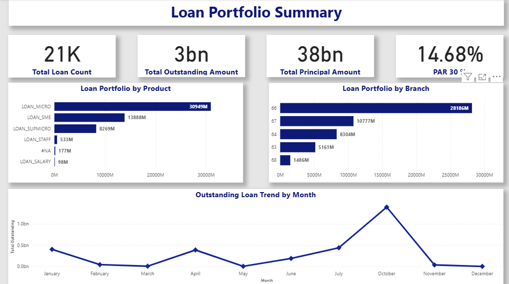
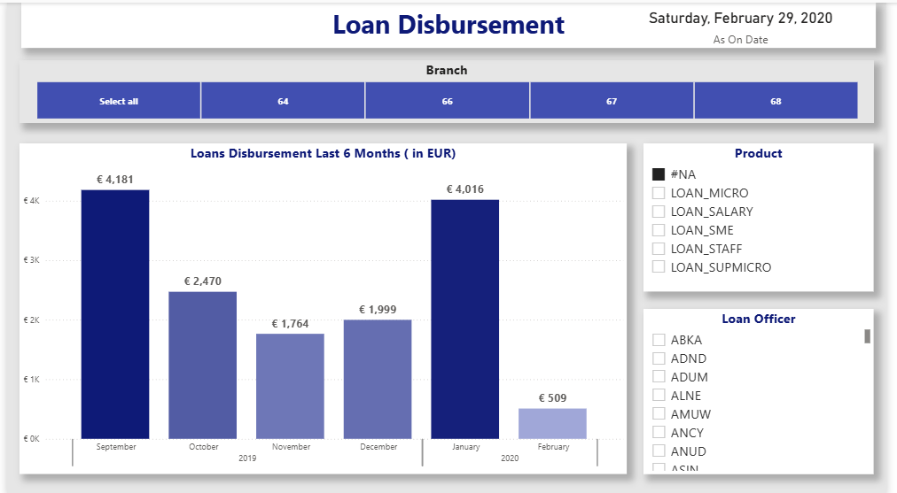
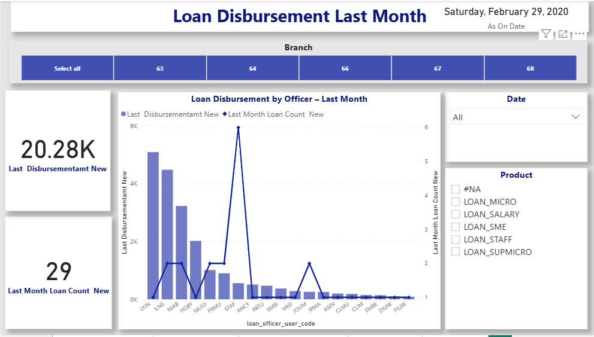
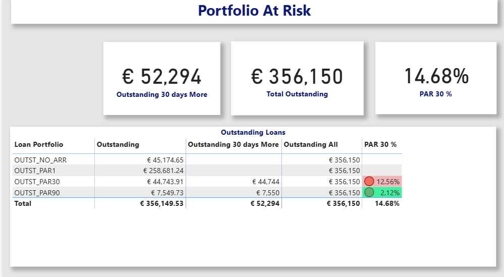
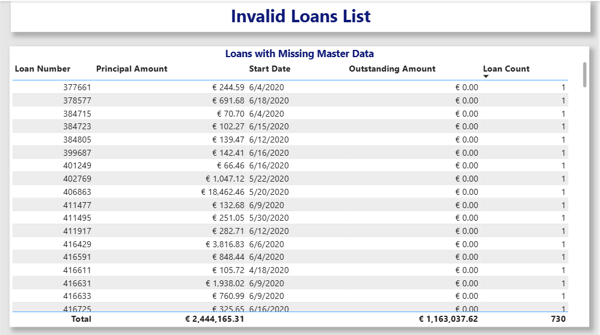

# 📊 Loan Portfolio Performance Dashboard – Power BI

## 📌 Project Overview
This Power BI dashboard analyzes loan portfolio performance and provides insights into loan distribution, outstanding balances, disbursement trends, and portfolio risk.

The goal of this report is to help financial stakeholders monitor portfolio health, track lending activity, and identify potential credit risk using key financial indicators.

---

## 🎯 Business Objectives
- Monitor overall **loan portfolio performance**
- Track **loan disbursement trends**
- Analyze **loan distribution by product and branch**
- Identify potential credit risk using **PAR 30 %**
- Understand **monthly portfolio trends**

---

## 🛠 Tools & Technologies Used
- **Power BI** – Data modeling and dashboard creation  
- **DAX** – Measures and KPI calculations  
- **Data Modeling** – Fact and dimension tables  
- **Excel / CSV Dataset**

---

## 📂 Dashboard Pages

### 1️⃣ KPI Overview
Provides high-level portfolio metrics including:
- Total Loans
- Total Outstanding Amount
- Total Principal Amount
- PAR 30 %

---

### 2️⃣ Loan Disbursement Analysis
Analyzes loan disbursement patterns including:
- Product-wise loan distribution
- Branch-wise loan distribution
- Overall lending activity

---

### 3️⃣ Last Month Performance
Focuses on recent portfolio activity including:
- Monthly loan performance
- Product contribution
- Branch-level lending activity

---

### 4️⃣ Invalid Loans Analysis
Identifies loans with missing or inconsistent master data to help maintain data quality and portfolio accuracy.

---

### 5️⃣ Loan Portfolio Summary
Provides a consolidated overview of the entire portfolio including:
- Loan portfolio by product
- Loan portfolio by branch
- Monthly outstanding loan trends
- Key portfolio KPIs

---

## 📊 Key Metrics Used
- **Total Loans**
- **Total Outstanding Amount**
- **Total Principal Amount**
- **PAR 30 % (Portfolio At Risk)**
- **Monthly Outstanding Trend**

---

## 📷 Dashboard Preview

---

## 🔗 Power BI Dashboard

👉 **View the Interactive Dashboard:**  
[Open Power BI Report]([POWER_BI_SERVICE_LINK_HERE](https://app.powerbi.com/view?r=eyJrIjoiZWFlZGIxMzItYTJiYy00NWY2LTljZTAtM2E0NzBiNTc5YWVhIiwidCI6IjNiY2YzZjA3LWFkMDAtNDlkMC1iOTNiLWI3ZWQ0MDA1MzI3NyJ9)

---

## 📈 Project Outcome
This dashboard enables financial stakeholders to:
- Monitor loan portfolio health
- Track lending performance
- Identify potential credit risk
- Support data-driven financial decision making
